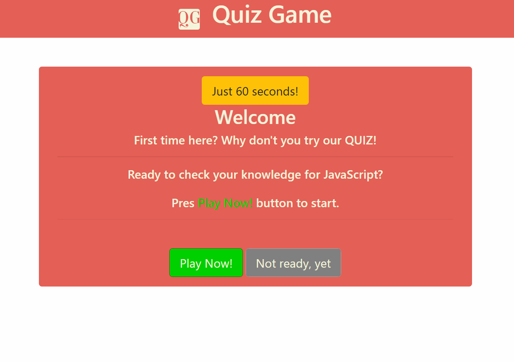

# 4_HW_code_quiz - [Deployed product](https://victorcodrean.github.io/4_HW_code_quiz/)

# Table of Contents

- [Description](#Description)
- [Instructions to play](#Instructions)
- [Illustration of generated password](#Illustration)
- [Framework HTML/CSS/JS](#Framework)
- [Quick GoThrough](#Gothrough)
- [Credits](#Credits)

## Description
An application consisting of a timing code quiz with multiple-choice to answer at questions.
* Available Time: 60 seconds
* Points: 10 points for right answer
* Penalties: -10 seconds for a wrong answer
* Submit the score once you finish

## Instructions
* 'Play Now' button to play or 'Not ready' to play later
* Once started, read the question and choose one answer
* After time is out or answered all questions you'll get the Score and the possibility to play again
* Below you can register your score.

## Illustration


## Framework
* HTML- Data & CSS - (build with bootstrap)
* JS - code:
    * Web API's (Transversing the DOM...)
        ```
        .querySelector
        .createElement
        .setAttribute
        .append()
        .addEventListener("click",)
        ...
        ```
    * for loops:
        ```
        .main loop to grab possible answers from an array of objects/(questions)
        ...
        for (i = 0; i < questions[definedIndex].choices.length; i++) {
            .createElement
            .setAttribute 
            .textContent = questions[definedIndex].choices[i];
            .append()
        }
        ```
    * if/else statements:

## Gothrough
* WHEN I click the start button
* THEN a timer starts and I am presented with a question
* WHEN I answer a question
* THEN I am presented with another question
* WHEN I answer a question incorrectly
* THEN time is subtracted from the clock
* WHEN all questions are answered or the timer reaches 0
* THEN the game is over
* WHEN the game is over
* THEN I can save my initials and my score

## Credits
* List of the resources used to complete this project:
    * - [Bootstrap](https://getbootstrap.com/)
    * - [StackOverFlow](https://stackoverflow.com/)
    * - [W3Schools](https://www.w3schools.com/) 
    * - [Html validator](https://validator.w3.org/nu/#textarea)
    * - [Git Hub](https://github.com/)

## Contributing
* Name: Victor Codrean
* [Email](CodreanVictor@gmail.com)
* [GitHub](https://github.com/VictorCodrean)

## Directory
* [Deployed Website](https://victorcodrean.github.io/4_HW_code_quiz/)
* [GitHub Source](https://github.com/VictorCodrean/4_HW_code_quiz)